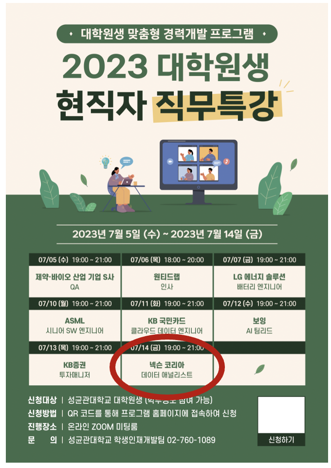
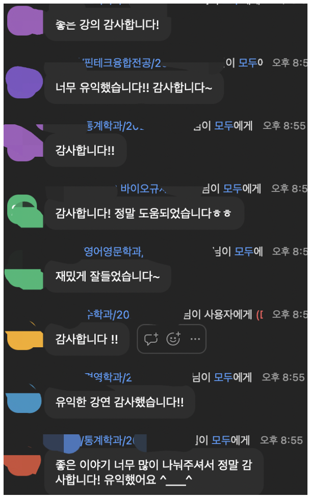

# 내 경험에 매력 한스푼 더하기
* **내 경험에 매력 한스푼 더하기라는 주제로** 성균관대에서 데이터 분석가 직무 강의를 했습니다. [(강의자료)](https://drive.google.com/file/d/1mZJGf1k0sGdiZCS-BiyZXNSe7m3n9vV1/view?usp=sharing)
* 흔히, 비전공자라고 불리는 대학원생 분들이 어떻게 본인의 강점을 살릴 수 있을까에 대해서 다루었습니다.
    * 가설검정을 위한 실험/인과추론
    * 직접 데이터를 수집하여 본인의 가설을 구체화하여 측정하고 검증하는 과정
* 학생분들 반응이 좋아서 개인적으로도 의미 있는 시간이었습니다.

